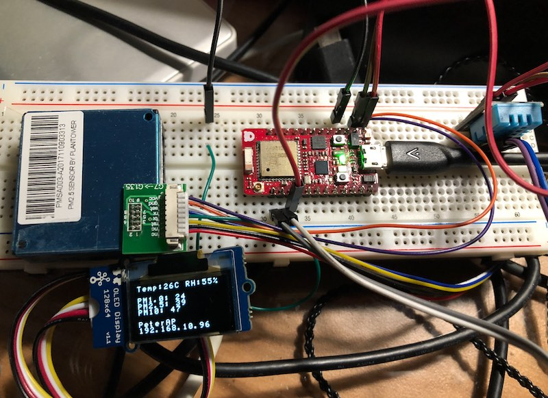
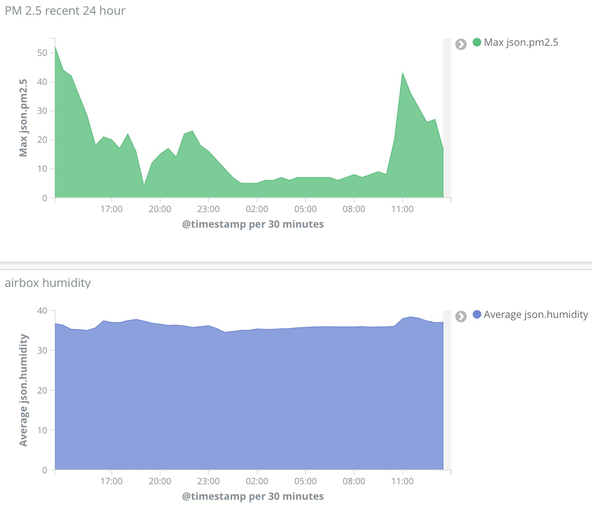
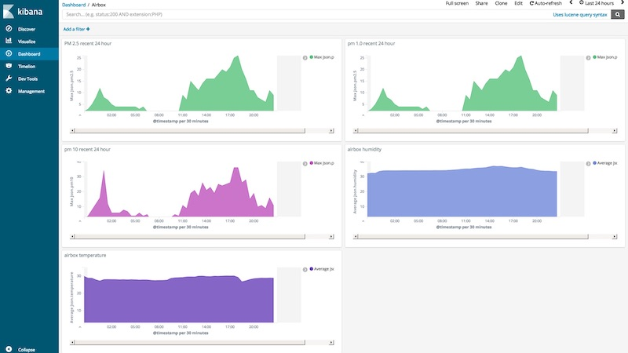

# AirBox
An open-source pm2.5 sensor and website




Developing


Feature: 
A low cost IoT WiFi/BLE based Airbox with pm1.0, pm2.5, pm10, Temperature and Humidity.

<hr>

##Sensor  
* pm2.5 Sensor(UART): [PMSA003](http://www.plantower.com/list/?6_1.html). 25 USD

* Temperature/Humidity(optional): [DHT11](https://www.adafruit.com/product/386) 5 USD or [DHT22](https://www.adafruit.com/product/385) 10 USD

* Display(optional): [Seed OLED Display](http://wiki.seeed.cc/Grove-OLED_Display_0.96inch/) 15 USD


## HTTP API
```
$ curl http://192.168.10.96

{
  "pm1.0": 12,
  "pm2.5": 15,
  "pm10": 15,
  "ver": 151,
  "error-code": 0,
  "pass": true,
  "temperature": 27,
  "humidity": 36,
  "SSID": "PeterAP",
  "IP": "192.168.10.96",
  "RSSI": -26
}
```

## Main Board
[RedBear Duo](rededbear.cc) for WiFi/BLE.  25 USD.  
Or any kind of development board.

## Easily to display on Kibana



